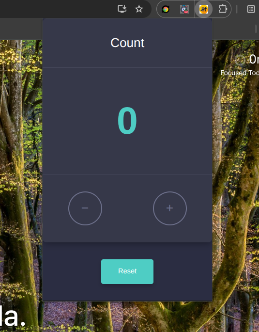

# Tally-Mark

### Set up keybinds

After installing, assign a keyboard shortcut at chrome://extensions/shortcuts.
Look For Tally-Mark and assign a keyboard (e.g Alt + Shift + T to open the popup).
Avoid Ctrl+T, Ctrl+W, Cmd+Q, etc.
